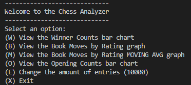
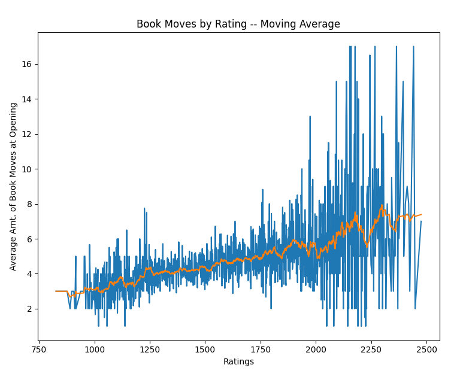
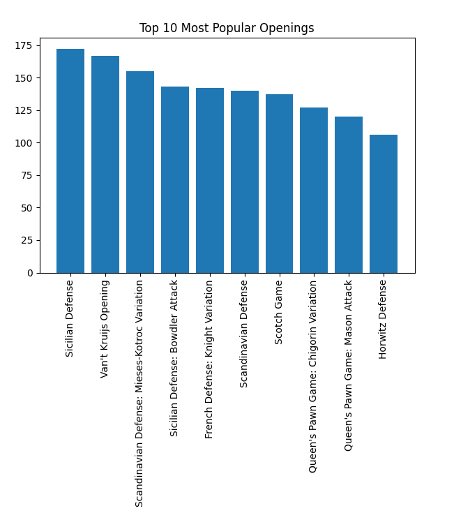
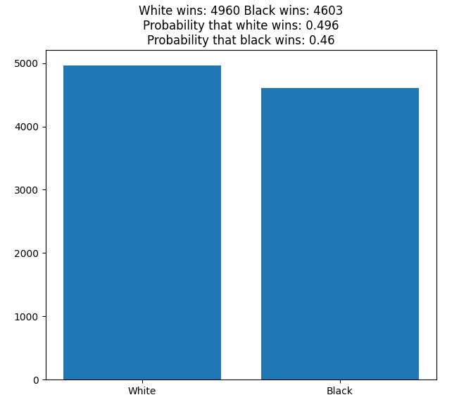

# Overview

ChessAnalysis is a collection of graphs and charts made from thousands of chess games on [Lichess.org](http://www.lichess.org). In the raw CSV file you will find details like number of turns, opening moves, winner's color, ratings, and more. One particularly interesting find from this dataset is in Figure 1, which shows that the amount of book moves increases linearly as rating increases. That was accomplished by computing a moving average with Pandas.

# Environment

* `pip install matplotlib`
* `pip install pandas`
* VSCode
* Python 3.8.6

# Execution

 
Figure 1 

 
Figure 2 

 
Figure 3

# Useful Websites

* [Mitchell J on Kaggle.com](https://www.kaggle.com/datasnaek/chess)
* [Pandas Example with Titanic Data](https://towardsdatascience.com/getting-started-to-data-analysis-with-python-pandas-with-titanic-dataset-a195ab043c77)
* [Moving Averages with Python](https://towardsdatascience.com/moving-averages-in-python-16170e20f6c)